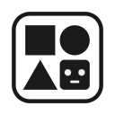

<p align="center"></p>

<h1 align="center">BotDock</h1>

<p align="center">
  <strong>Your Multi-Machine Agent Workspace.</strong><br>
  Track and interact with all your <code>claude-code</code> / <code>codex</code> agent sessions in one page.
</p>

<p align="center">
  <a href="https://www.youtube.com/watch?v=JdU34YknC2A">
    
  </a>
</p>

<p align="center">
  <a href="https://www.botdock.net/">Website</a>
  ·
  <a href="https://www.youtube.com/watch?v=JdU34YknC2A">Demo</a>
  ·
  <a href="CHANGELOG.md">Changelog</a>
  ·
  <a href="https://github.com/camelop/dev.botdock.net/issues/new?template=feature_request.md">Feature requests</a>
</p>

---

BotDock is a single-binary local server that pulls every Claude Code / codex session you run on every SSH-reachable machine into one web page — sidebar, embedded terminal (via ttyd), live transcript, and per-session VS Code / file browser scoped to the workdir. Sessions live in remote `tmux`es; the daemon mirrors event + raw + transcript JSONL back over SSH so a daemon restart doesn't lose history. Embedded React UI ships inside the binary; no external database, everything persists as TOML/NDJSON under the data dir.

> ⚠️  **BotDock is an early-stage research prototype**, single-user with no real auth, and a significant chunk of the code is itself agent-generated. Use it for personal / research work; **don't expose it on a public network or run production loads on it**.

## Install

```sh
curl -fsSL https://raw.githubusercontent.com/camelop/dev.botdock.net/main/install.sh | bash
```

Re-run the same command to upgrade. Supported platforms: `linux-x64`, `linux-arm64`, `darwin-x64`, `darwin-arm64`.

Runtime prereqs on the machine running the daemon: `ssh`, `ssh-keygen`, `tmux`, `rsync` (the last is used for ＋Context push; BotDock will auto-install it on target machines if missing).

## Quick start

Three steps, about a minute:

```sh
# 1. One command — inits ~/.botdock/client-default if missing, spawns a
#    background server, and opens the dashboard in your browser.
botdock start

# 2. In the UI: create an SSH key, register a machine (with optional
#    jump-host chain), and run the connection test until it goes green.

# 3. Spawn Claude Code or codex sessions on any registered machine and
#    drive them all from the workspace.
```

`botdock stop` cleanly shuts the daemon down (drains SSH forwards before exit).

Prefer to keep state in a specific directory? Use `botdock serve` from inside it — same server, foreground, tied to your terminal:

```sh
mkdir -p ~/botdock && cd ~/botdock
botdock init .
botdock serve
```

Everything BotDock knows is under the data dir. Back it up or keep it in git (but remember `private/` holds plaintext keys and secrets in v1 — don't commit those). Per-session **Export** ships a portable `.zip` another BotDock can import to attach to the same remote tmux.

## What it does

- **Manage Claude Code / codex sessions across machines, in one workspace.** Spin up agents on any registered machine and watch them all from a single three-column workspace — sidebar, terminal, transcript — without juggling tmux panes or SSH terminals.
- **Status tracking and tagging.** Every session carries a status pill (running / pending / syncing / exited), an optional alias and accent color, and free-form tags. The dashboard surfaces what *needs your attention* first.
- **One-click access to your working directory.** Spawn a per-session `filebrowser` or VS Code (`code-server`) instance, scoped to the session's workdir, with one click. Both run on the remote and reverse-proxy through BotDock so you stay in one tab.
- **Prepare context once, reuse it everywhere.** Curate reusable context centrally — markdown snippets, git repos with optional deploy keys, arbitrary file bundles — and push it into any session's workdir on demand.

Full demo with timestamps: [youtu.be/JdU34YknC2A](https://www.youtube.com/watch?v=JdU34YknC2A).

## CLI

All commands take an optional `--home <dir>` (defaults to `$BOTDOCK_HOME` or cwd; `start` / `stop` default to `~/.botdock/client-default`).

```
botdock start                         init (if needed) + spawn a background
                                      server + open browser
botdock stop                          stop the daemon started by `start`
                                      (drains SSH forwards before exit)
botdock init [dir]                    scaffold a data directory
botdock serve [--dev]                 run the web server in the foreground
botdock key create <nickname>         generate ed25519
botdock key import <nick> <path>      import an existing OpenSSH private key
botdock key list / show / delete
botdock machine add <name> --host H --user U --key K [--port N] [--tag T]
botdock machine list / show / edit / remove
botdock machine test <name>           dial through the full jump chain
botdock secret set <name>             reads value from stdin
botdock secret list / show / remove
botdock --version
```

## What's in the UI

- **Dashboard** — counts + recent-session list, "+ New session" launcher.
- **Sessions → Workspace / Card / List** — three views on the same sessions: three-column workspace (grouped sidebar · terminal · transcript + events), boring-avatar card grid, or flat table with a detail modal. Each session carries a brand-mark icon (Anthropic / OpenAI / `>_`) so kinds are distinguishable at a glance.
- **Context → Git Repos / Markdown / File Bundles** — curate reusable inputs you can push into any session's workdir with one click; optional deploy keys for private clones, markdown notes edited in Monaco, arbitrary directory trees imported as folders or tar/zip.
- **Machines → Machines / Forwards / Terminals** — SSH targets with jump-host chains and a reserved `local` loopback entry, user-managed port forwards (with an optional web proxy for `-L` forwards), and lazy-connected per-machine terminals.
- **Private → Keys / Secrets** — ed25519 key management + secret storage.

## Development

```sh
bun install
bun test
bun run typecheck
bun run web:dev               # Vite on :5173, proxies /api → :4717
bun src/cli.ts serve --dev    # API only, frontend comes from Vite
bun run build                 # compile ./dist-bin/botdock for the host
bun run build:all             # cross-compile all four platforms
```

User-visible changes: [`CHANGELOG.md`](CHANGELOG.md).

## License

[Apache License 2.0](LICENSE). © 2026 BotDock. All rights reserved.
